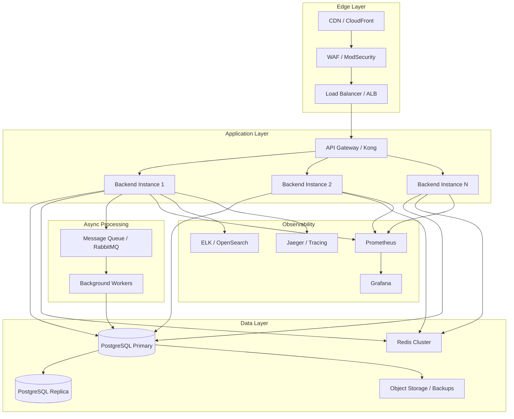

# MedOS HMS — Target Production Architecture

## Current State Assessment

The current architecture is a monolithic Spring Boot application with:
- Single backend instance
- Direct PostgreSQL + Redis access
- No API gateway
- No async processing
- No distributed tracing
- Basic Docker Compose deployment

## Target Architecture



## Layer Details

### 1. Edge Layer
| Component | Purpose | Implementation |
|-----------|---------|----------------|
| CDN | Static asset caching, DDoS protection | CloudFront / Cloudflare |
| WAF | SQL injection, XSS, bot protection | ModSecurity / AWS WAF |
| Load Balancer | SSL termination, health checks | ALB / Nginx Plus |

### 2. Application Layer
| Component | Purpose | Implementation |
|-----------|---------|----------------|
| API Gateway | Rate limiting, auth, routing, metrics | Kong / Spring Cloud Gateway |
| Backend Instances | Business logic, stateless | Spring Boot 3.2, Docker, K8s pods |

### 3. Data Layer
| Component | Purpose | Implementation |
|-----------|---------|----------------|
| PostgreSQL Primary | Write operations, ACID transactions | PostgreSQL 15+ with connection pooling |
| PostgreSQL Replica | Read-heavy dashboard queries | Streaming replication, read-only |
| Redis Cluster | Cache, sessions, rate limiting | Redis 7+ with AOF + RDB persistence |
| Object Storage | Backups, documents, reports | S3 / MinIO |

### 4. Observability Layer
| Component | Purpose | Implementation |
|-----------|---------|----------------|
| Prometheus | Metrics collection | Spring Boot Actuator + Micrometer |
| Grafana | Dashboards, alerting | Pre-built HMS dashboards |
| ELK/OpenSearch | Log aggregation, search | Filebeat + Logstash + OpenSearch |
| Jaeger | Distributed tracing | OpenTelemetry Java agent |

### 5. Async Processing Layer
| Component | Purpose | Implementation |
|-----------|---------|----------------|
| Message Queue | Decouple async operations | RabbitMQ / AWS SQS |
| Background Workers | Notifications, lab processing, audit logs | Spring Boot workers |

## Data Flow

### Synchronous Flow (Critical Paths)
```
Client → CDN → WAF → LB → API Gateway → Backend → PostgreSQL Primary
                                    ↓
                              PostgreSQL Replica (reads)
                                    ↓
                              Redis Cluster (cache)
```

### Asynchronous Flow (Non-Critical)
```
Backend → Message Queue → Worker → PostgreSQL Primary
                                    ↓
                              Notifications (WebSocket)
                              Audit Logs (batch insert)
                              Lab Results (processing)
```

## Security Architecture

```
┌─────────────────────────────────────────────────────────────┐
│                    Security Layers                          │
├─────────────────────────────────────────────────────────────┤
│ 1. WAF: SQL injection, XSS, bot protection                  │
│ 2. DDoS Protection: Rate limiting at edge                   │
│ 3. API Gateway: JWT validation, rate limiting, IP allowlist │
│ 4. Backend: RBAC, input validation, audit logging           │
│ 5. Database: Encryption at rest, row-level security         │
│ 6. Redis: AUTH, TLS, key expiration                         │
│ 7. Secrets: Vault / AWS Secrets Manager                     │
└─────────────────────────────────────────────────────────────┘
```

## Deployment Architecture

### Kubernetes Deployment
```yaml
# Backend Deployment
apiVersion: apps/v1
kind: Deployment
metadata:
  name: medos-backend
spec:
  replicas: 3
  strategy:
    type: RollingUpdate
    rollingUpdate:
      maxSurge: 1
      maxUnavailable: 0
  template:
    spec:
      containers:
      - name: backend
        image: medos-backend:3.0.0
        ports:
        - containerPort: 8080
        resources:
          requests:
            memory: "512Mi"
            cpu: "500m"
          limits:
            memory: "1Gi"
            cpu: "1000m"
        livenessProbe:
          httpGet:
            path: /manage/health/liveness
            port: 8080
          initialDelaySeconds: 60
          periodSeconds: 10
        readinessProbe:
          httpGet:
            path: /manage/health/readiness
            port: 8080
          initialDelaySeconds: 30
          periodSeconds: 5
```

### Database High Availability
```
Primary (write)
    ↓ streaming replication
Replica 1 (read)
    ↓ streaming replication
Replica 2 (read, DR)

Failover: Patroni / repmgr
Backup: pg_dump + WAL archiving to S3
```

## Caching Strategy

| Cache Layer | TTL | Purpose |
|-------------|-----|---------|
| Medicine Catalog | 4 hours | Drug master data |
| Rooms | 30 minutes | Bed availability |
| User Sessions | 10 hours | JWT + refresh tokens |
| Rate Limits | 15 minutes | Login brute-force protection |
| Dashboard Stats | 5 minutes | Aggregated metrics |

## Monitoring & Alerting

### Key Metrics
- **Application**: Request rate, error rate, latency (p50, p95, p99)
- **Database**: Connection pool usage, query latency, replication lag
- **Redis**: Hit rate, memory usage, evictions
- **Business**: Active patients, pending prescriptions, revenue

### Alert Rules
- Error rate > 1% for 5 minutes
- p99 latency > 2 seconds for 5 minutes
- Database connections > 80% of pool
- Redis memory > 85%
- Disk usage > 80%

## Disaster Recovery

| Scenario | RTO | RPO | Strategy |
|----------|-----|-----|----------|
| Single backend pod failure | < 30s | 0 | K8s self-healing |
| Database primary failure | < 5 min | < 1 min | Automated failover to replica |
| Redis failure | < 1 min | < 5 min | In-memory fallback + restart |
| Full region failure | < 1 hour | < 15 min | Cross-region backup restore |

## Technology Stack Summary

| Layer | Current | Target |
|-------|---------|--------|
| Frontend | React + Vite | React + Vite + PWA |
| Backend | Spring Boot 3.2 | Spring Boot 3.2 + Spring Cloud Gateway |
| Database | PostgreSQL | PostgreSQL + Read Replicas |
| Cache | Redis | Redis Cluster |
| Queue | None | RabbitMQ / SQS |
| Monitoring | None | Prometheus + Grafana |
| Logging | File | ELK / OpenSearch |
| Tracing | None | Jaeger / OpenTelemetry |
| Secrets | .env | Vault / AWS Secrets Manager |
| Deployment | Docker Compose | Kubernetes / ECS |