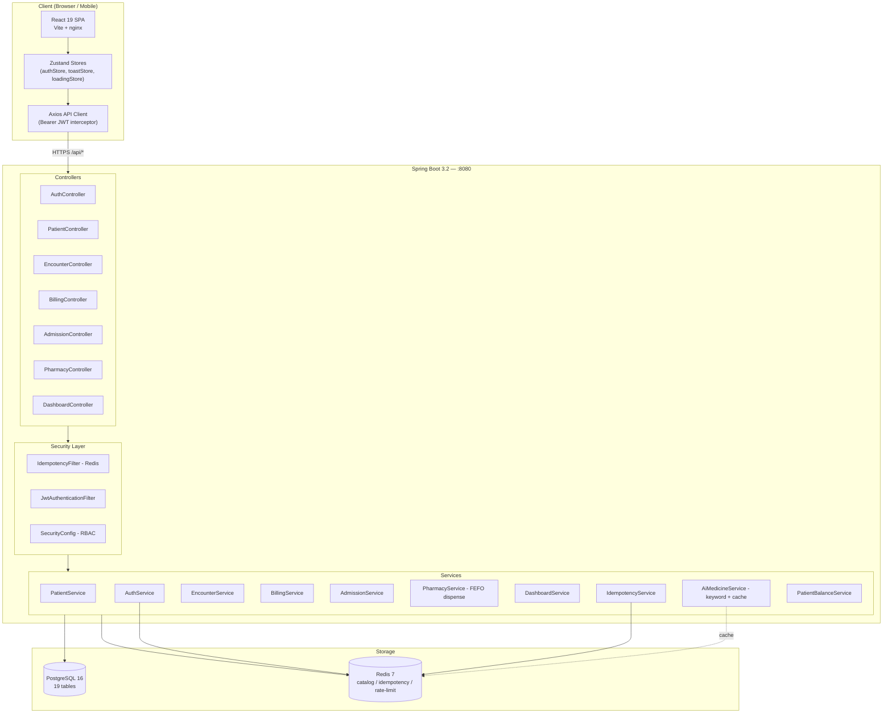
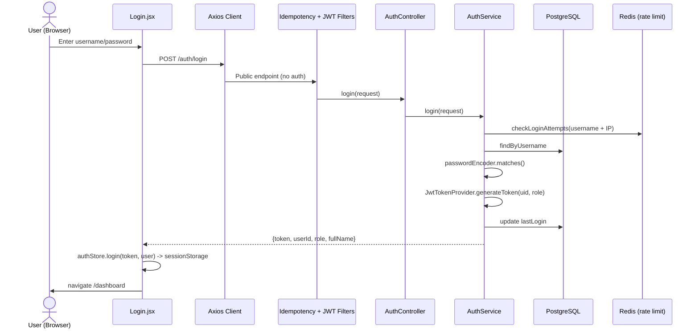
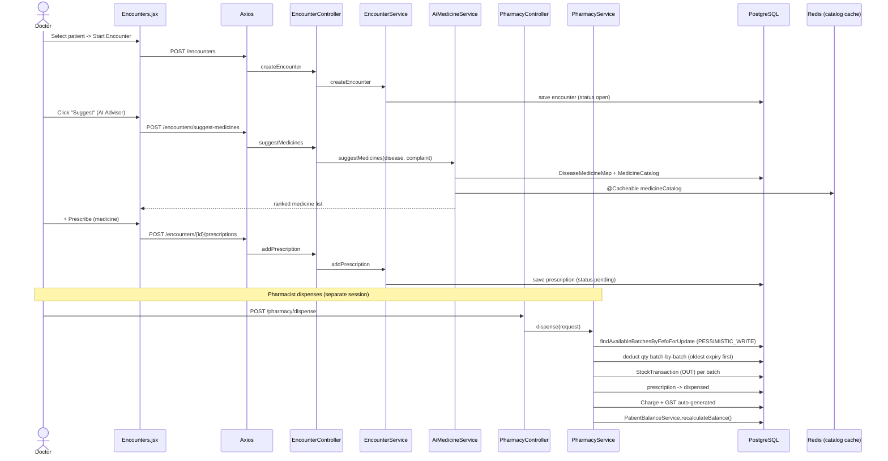
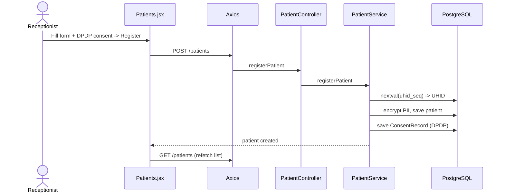
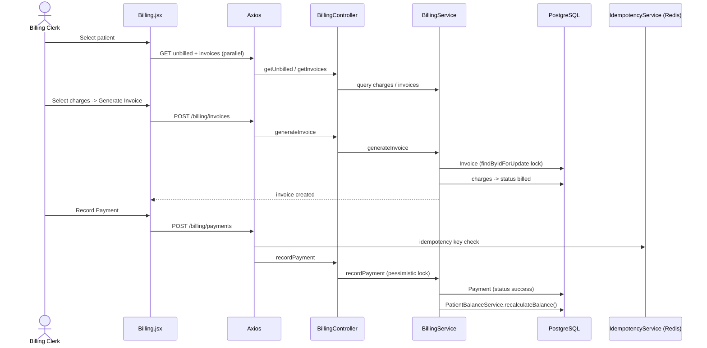
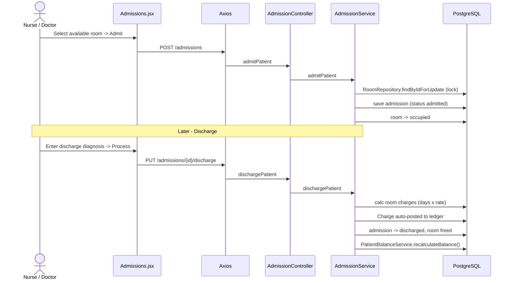
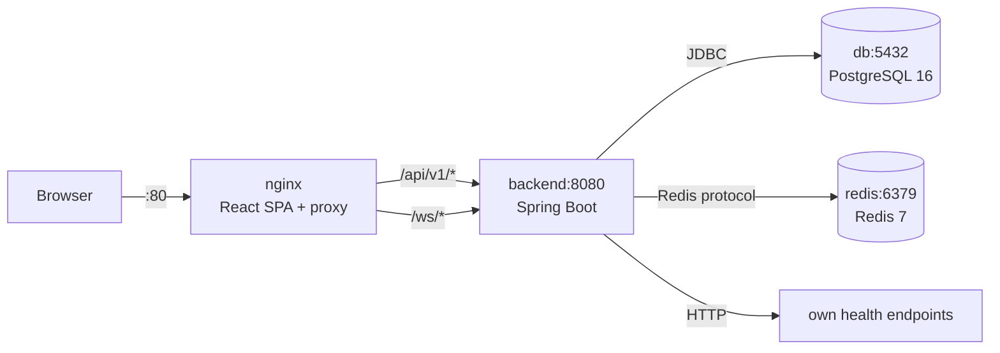

# MedOS HMS — Structure & Sequence Diagrams

Actual diagrams of the current running system (Spring Boot 3.2 + React 19 + PostgreSQL 16 + Redis 7, Docker Compose).

> Mermaid diagrams — render in GitHub, VS Code (Markdown Preview Mermaid), or any Mermaid viewer.

## 1. System Architecture (Structure)

## 2. Authentication Sequence

## 3. Clinical Flow — Encounter -> Prescription -> Dispense -> Charge

## 4. Patient Registration Sequence

## 5. Billing — Invoice + Payment Sequence

## 6. Admission -> Discharge Sequence

## Cross-Cutting Mechanisms

| Mechanism | Implementation | Where |
|-----------|----------------|-------|
| **Auth** | JWT HS256, `uid` + `role` claims, stateless | `JwtAuthenticationFilter` -> `SecurityContext` |
| **RBAC** | `@PreAuthorize("hasRole(...)")` | All controllers |
| **Idempotency** | Redis key `idempotency:{ep}:{key}`, 24h TTL | payments, invoices, dispense |
| **Caching** | `@Cacheable medicineCatalog` (4h), rooms (30m) | `AiMedicineService`, `AdmissionService` |
| **FEFO** | `ORDER BY expiryDate ASC` + `PESSIMISTIC_WRITE` | `PharmacyService.dispense` |
| **Balance** | `outstanding = SUM(charges) - SUM(payments)` (atomic) | `PatientBalanceService` |
| **Rate limit** | Max 5 fails / 15 min per user + IP | `LoginRateLimiter` (Redis) |

## API Versioning

All REST endpoints are versioned under `/api/v1/...`.

### Versioning Scheme

- **Current version**: `v1`
- **Base path**: `/api/v1/{domain}/{resource}`
- **Example**: `POST /api/v1/encounters`, `GET /api/v1/patients/{id}`

### When to bump the version

| Change type | Action |
|-------------|--------|
| New endpoint | Add to current version |
| New optional field | Add to current version |
| New required field | Consider new version |
| Breaking change (rename/remove field, change behavior) | New version `/api/v2/...` |

### OpenAPI Documentation

- **Swagger UI**: `http://localhost:8080/swagger-ui.html` (requires `ADMIN` role)
- **OpenAPI JSON**: `http://localhost:8080/v3/api-docs` (requires `ADMIN` role)
- The API docs include JWT Bearer authentication scheme — click "Authorize" and paste your token

### Controllers by Domain

| Controller | Base Path | Description |
|------------|-----------|-------------|
| `AuthController` | `/api/v1/auth` | Login |
| `PatientController` | `/api/v1/patients` | Patient CRUD |
| `EncounterController` | `/api/v1/encounters` | OPD encounters, prescriptions, AI suggestions |
| `AdmissionController` | `/api/v1/admissions` | IPD admission/discharge, rooms |
| `PharmacyController` | `/api/v1/pharmacy` | Medicine catalog, stock, FEFO dispense |
| `BillingController` | `/api/v1/billing` | Invoices, payments |
| `DashboardController` | `/api/v1/dashboard`, `/api/v1/notifications`, `/api/v1/users` | Dashboard stats, notifications |

## Docker Compose Topology

