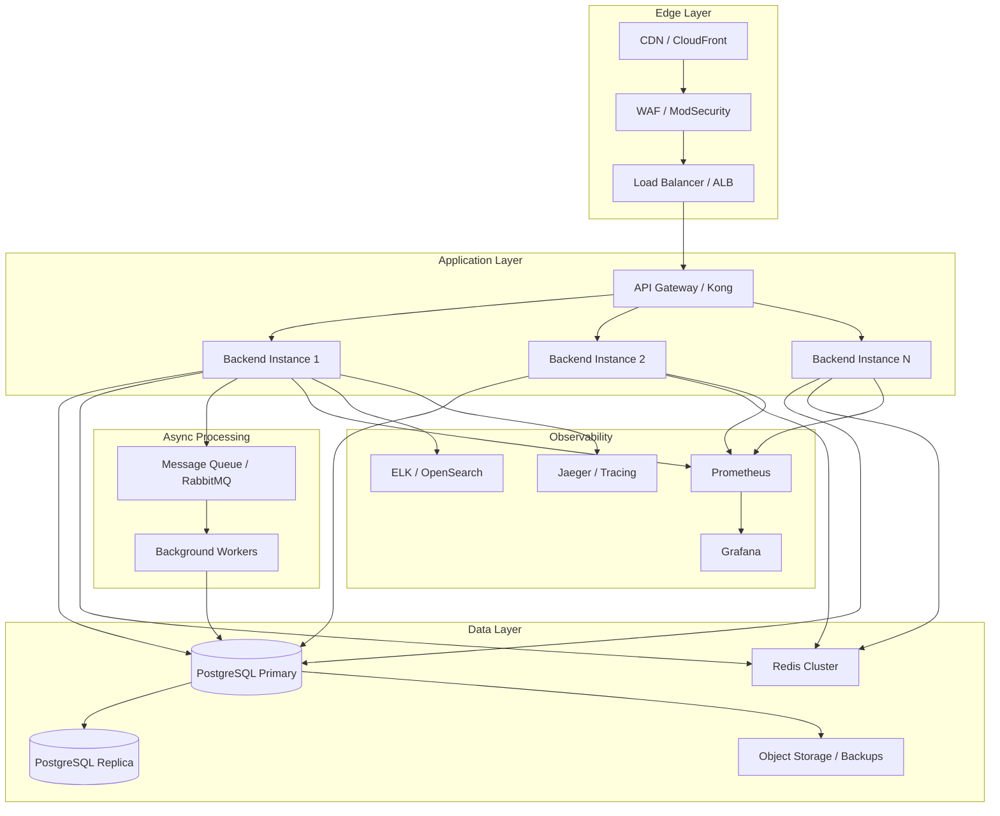

# MedOS HMS — Production Readiness Verdict

**Verdict: NOT PRODUCTION READY** ❌

The codebase shows strong architectural intent and solid security foundations, but contains **critical data integrity bugs** and **missing operational capabilities** that make it unsafe for production deployment in a real hospital environment.

---

## Executive Summary

| Category | Status | Critical Issues |
|----------|--------|-----------------|
| **Security** | 🟡 Partial | Good foundation, but missing CSP, refresh tokens, API rate limiting |
| **Data Integrity** | 🔴 Critical | Race conditions in UHID/invoice generation, balance sync conflicts |
| **Reliability** | 🔴 Critical | No DB backups, no monitoring, insufficient test coverage |
| **Compliance** | 🟡 Partial | PII encryption present, but no audit review, no retention policies |
| **Observability** | 🔴 Missing | No metrics, no structured logging, no tracing |
| **API Design** | 🟡 Partial | No versioning, no OpenAPI docs, some over-exposed endpoints |
| **Frontend** | 🟡 Partial | No token refresh, missing feature modules, no offline handling |
| **DevOps** | 🟡 Partial | CI exists but needs hardening, no CD, no secret management |

---

## Critical Blockers (Must Fix Before Production)

### 1. 🔴 Race Condition: Invoice/Payment Number Generation
**File:** [`BillingService.java`](backend/src/main/java/com/medos/service/BillingService.java:167)
```java
private String generateInvoiceNumber() {
    return "INV-" + System.currentTimeMillis() % 1000000;
}
```
**Impact:** Under concurrent load, two requests can generate the same invoice number, causing a unique constraint violation and billing failure.

**Fix:** Use a database sequence or atomic counter with retry logic.

### 2. 🔴 Race Condition: UHID Generation
**File:** [`PatientService.java`](backend/src/main/java/com/medos/service/PatientService.java:103)
```java
private String generateUhid() {
    Integer max = patientRepository.findMaxUhidSequence().orElse(0);
    return String.format("UHID%06d", (max == null ? 0 : max) + 1);
}
```
**Impact:** Two concurrent patient registrations will receive the same UHID, violating the unique constraint and potentially mixing patient records.

**Fix:** Use a database sequence or `SELECT ... FOR UPDATE` with proper transaction isolation.

### 3. 🔴 Data Integrity: Conflicting Balance Calculations
**Files:**
- [`BillingService.syncPatientBalance()`](backend/src/main/java/com/medos/service/BillingService.java:175) — sums `billed + paid` charges
- [`PharmacyService.syncPatientBalance()`](backend/src/main/java/com/medos/service/PharmacyService.java:209) — sums only `unbilled` charges

**Impact:** The `patient.outstanding` field is non-deterministic. After a pharmacy dispense, the balance drops to unbilled total. After billing generates an invoice, it jumps to billed+paid total. This creates audit discrepancies and incorrect financial reporting.

**Fix:** Standardize on a single source of truth: `outstanding = SUM(charges WHERE status IN (billed, paid)) - SUM(payments WHERE status = success)`. Remove the pharmacy override.

### 4. 🔴 Missing RBAC on Sensitive Endpoints
**Files:**
- [`BillingController.java`](backend/src/main/java/com/medos/controller/BillingController.java:32) — `GET /api/billing/patients/{id}/invoices` allows any authenticated user to view any patient's invoices
- [`BillingController.java`](backend/src/main/java/com/medos/controller/BillingController.java:38) — `GET /api/billing/patients/{id}/unbilled` same issue
- [`EncounterController.java`](backend/src/main/java/com/medos/controller/EncounterController.java:36) — `GET /api/encounters/{id}` allows any authenticated user to view any encounter

**Impact:** A receptionist can view billing details for all patients. A nurse can view any doctor's clinical notes. This violates HIPAA/DPDP principles of minimum necessary access.

**Fix:** Implement patient-scoped or role-scoped access control. Use `@PreAuthorize` with custom expressions or service-layer checks.

### 5. 🔴 No Database Backup Strategy
**File:** [`docker-compose.yml`](docker-compose.yml:18)
**Impact:** A single hardware failure or human error can wipe all patient data. No automated backups, no tested restore procedure.

**Fix:** Add automated pg_dump cron job, store backups in S3/equivalent, test restores quarterly.

---

## High-Priority Issues (Fix Within 1 Sprint)

### 6. 🟠 No API Versioning
The README mentions "API versioning plan" as a TODO. Without versioning, any breaking change will break existing frontend clients.

**Fix:** Add `/api/v1/` prefix to all endpoints. Return `API-Version` header.

### 7. 🟠 No OpenAPI Documentation
No Swagger/springdoc in [`pom.xml`](backend/pom.xml). Frontend and external integrators have no contract to rely on.

**Fix:** Add springdoc-openapi, generate OpenAPI spec, host at `/swagger-ui.html` (admin-only).

### 8. 🟠 No Structured Logging / Correlation IDs
Logs are plain text. In a multi-service environment, tracing a single request across services is impossible.

**Fix:** Add Logback with JSON encoder, implement `MDC` correlation ID filter, propagate `X-Correlation-ID` header.

### 9. 🟠 No Refresh Token Mechanism
JWT expires in 10 hours. After expiration, users are logged out with no warning. No silent refresh.

**Fix:** Issue refresh tokens (stored in Redis), add `/api/auth/refresh` endpoint, implement token rotation.

### 10. 🟠 Insufficient Test Coverage
- Backend: ~55 unit tests, no integration tests
- Frontend: 7 tests
- No E2E tests for critical flows (admission → discharge → billing)

**Fix:** Add integration tests for all service boundaries, E2E tests for critical patient journeys.

### 11. 🟠 Redis Persistence Not Configured
[`docker-compose.yml`](docker-compose.yml:58) mounts `/data` but [`cache/redis.conf`](cache/redis.conf) is not used. Redis uses default RDB snapshots.

**Fix:** Mount `redis.conf` with `appendonly yes` and `save` directives.

### 12. 🟠 No Input Validation on Financial Fields
- `BillingService.recordPayment()` accepts any positive amount, no validation that amount > 0
- `BillingService.generateInvoice()` accepts negative discounts
- `AdmissionService.dischargePatient()` calculates days as `ChronoUnit.DAYS.between() + 1` which is incorrect for same-day discharges

**Fix:** Add Jakarta Validation annotations and service-layer guards.

---

## Medium-Priority Issues (Fix Within 2 Sprints)

### 13. 🟡 Missing Feature Controllers
Entities exist but have no API endpoints:
- `LabOrder` — no controller/service
- `OpdQueue` — no controller/service
- `Consent` — no controller/service
- `Notification` — no controller/service
- `DiseaseMedicineMap` — no controller/service

**Impact:** These features are non-functional. The frontend has no pages for them.

### 14. 🟡 Frontend Gaps
- No token refresh / silent re-authentication
- No offline queue for failed requests
- No retry logic with exponential backoff
- Missing pages: Lab, Queue, Consent, Notifications
- No form validation on the frontend

### 15. 🟡 No Rate Limiting on API Endpoints
Only login has rate limiting. All other endpoints are vulnerable to scraping, enumeration, and DoS.

**Fix:** Add bucket4j or Spring Cloud Gateway rate limiting per user/IP.

### 16. 🟡 No Content Security Policy
Frontend has no CSP headers, leaving it vulnerable to XSS.

**Fix:** Add CSP headers in [`frontend/nginx.conf`](frontend/nginx.conf).

### 17. 🟡 No Automated Security Scanning
No Trivy, no OWASP ZAP, no dependency vulnerability scanning in CI.

**Fix:** Add Trivy image scan to CI, add OWASP dependency-check.

---

## Low-Priority / Technical Debt

### 18. 🟢 No Database Connection Pool Metrics
HikariCP is configured but no metrics exposed. Cannot detect connection pool exhaustion before it causes outages.

### 19. 🟢 No Feature Flags
AI service is disabled via config, but there's no feature flag framework for gradual rollouts.

### 20. 🟢 No Multi-Tenancy
Single database, single tenant. If deploying for multiple hospitals, schema changes needed.

### 21. 🟢 No Data Retention Policy
Audit logs and old records grow indefinitely. No archival or deletion policy.

---

## Architecture Assessment

### Current Architecture
```
┌─────────────┐     ┌─────────────┐     ┌─────────────┐
│   Frontend  │────▶│   Backend   │────▶│  PostgreSQL │
│  React+Vite │     │ Spring Boot │     │   + Redis   │
└─────────────┘     └─────────────┘     └─────────────┘
       │                   │
       │                   │
  nginx (edge)      WebSocket (STOMP)
```

**Strengths:**
- Clean separation of concerns
- Stateless JWT auth
- Redis for caching and rate limiting
- Docker Compose for local dev

**Weaknesses:**
- Single backend instance — no horizontal scaling strategy
- No API gateway for rate limiting, auth, or routing
- No message queue for async operations (notifications, lab results)
- No CDN for static assets
- No WAF in front of the application

---

## Recommended Target Architecture



### Key Architectural Changes Needed

1. **API Gateway**: Add Kong/Spring Cloud Gateway for rate limiting, auth, and routing
2. **Read Replicas**: Route read-heavy dashboard queries to PostgreSQL replicas
3. **Message Queue**: Offload async work (notifications, lab result processing, audit log writes)
4. **Object Storage**: Store documents, reports, and backups in S3-compatible storage
5. **Distributed Tracing**: Implement OpenTelemetry for request tracing
6. **Secrets Management**: Replace `.env` with HashiCorp Vault or AWS Secrets Manager

---

## Implementation Plan

The plan is organized into 4 phases, each with specific GitHub issues.

### Phase 0: Critical Blockers (Week 1-2) — P0
**Goal:** Fix data integrity bugs that make the system unsafe.

- [ ] #1 Fix invoice/payment number generation race condition
- [ ] #2 Fix UHID generation race condition
- [ ] #3 Standardize patient balance calculation
- [ ] #4 Add RBAC on billing and encounter endpoints
- [ ] #5 Add input validation on financial fields
- [ ] #6 Fix discharge days calculation bug

### Phase 1: Reliability & Observability (Week 3-4) — P1
**Goal:** Make the system observable and reliable.

- [ ] #7 Add API versioning (`/api/v1/`)
- [ ] #8 Add OpenAPI documentation (springdoc)
- [ ] #9 Implement structured logging with correlation IDs
- [ ] #10 Add refresh token mechanism
- [ ] #11 Configure Redis persistence (AOF + RDB)
- [ ] #12 Add automated database backups
- [ ] #13 Add HikariCP metrics to Prometheus

### Phase 2: Security Hardening (Week 5-6) — P2
**Goal:** Harden security posture for production.

- [ ] #14 Add rate limiting on all API endpoints
- [ ] #15 Add Content Security Policy headers
- [ ] #16 Implement token rotation and reuse detection
- [ ] #17 Add Trivy image scanning to CI
- [ ] #18 Add OWASP dependency check to CI
- [ ] #19 Implement request size limits
- [ ] #20 Add security headers (HSTS, X-Frame-Options, etc.)

### Phase 3: Feature Completion (Week 7-10) — P3
**Goal:** Complete missing features and frontend modules.

- [ ] #21 Implement Lab Orders module (backend + frontend)
- [ ] #22 Implement OPD Queue module (backend + frontend)
- [ ] #23 Implement Consent management module
- [ ] #24 Implement Notifications module
- [ ] #25 Implement Disease-Medicine Map management
- [ ] #26 Complete frontend token refresh and error handling
- [ ] #27 Add E2E tests for critical patient journeys

### Phase 4: Production Deployment (Week 11-12) — P4
**Goal:** Deploy to production with full monitoring.

- [ ] #28 Set up Prometheus + Grafana dashboards
- [ ] #29 Set up ELK/OpenSearch for log aggregation
- [ ] #30 Implement OpenTelemetry distributed tracing
- [ ] #31 Configure WAF and DDoS protection
- [ ] #32 Set up CI/CD pipeline with automated deployments
- [ ] #33 Create runbooks for common operations
- [ ] #34 Conduct disaster recovery drill
- [ ] #35 Conduct security penetration test

---

## Detailed GitHub Issues

See individual issue files in [`docs/issues/`](docs/issues/) for each of the 35 items above.

---

## Recommendations

1. **Do NOT deploy to production** until Phase 0 is complete. The race conditions in UHID and invoice generation are data integrity issues that can corrupt patient records and financial data.

2. **Prioritize the balance calculation fix** — this is a silent data corruption bug that will cause financial discrepancies.

3. **Invest in test coverage** — a medical system without comprehensive tests is a liability. Aim for 80%+ coverage on business logic.

4. **Plan for scale** — the current single-instance architecture will not handle peak hospital loads. Design for horizontal scaling from day one.

5. **Engage a security auditor** — before going live, have a third party perform a penetration test focused on OWASP Top 10 and healthcare compliance (HIPAA/DPDP).

---

*Generated: 2026-08-22*
*Analyzed by: Architect Mode*