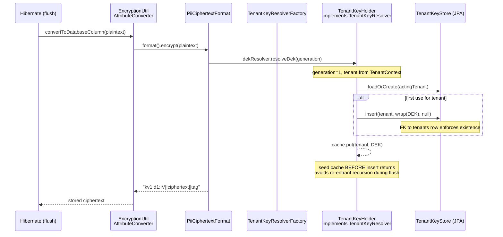
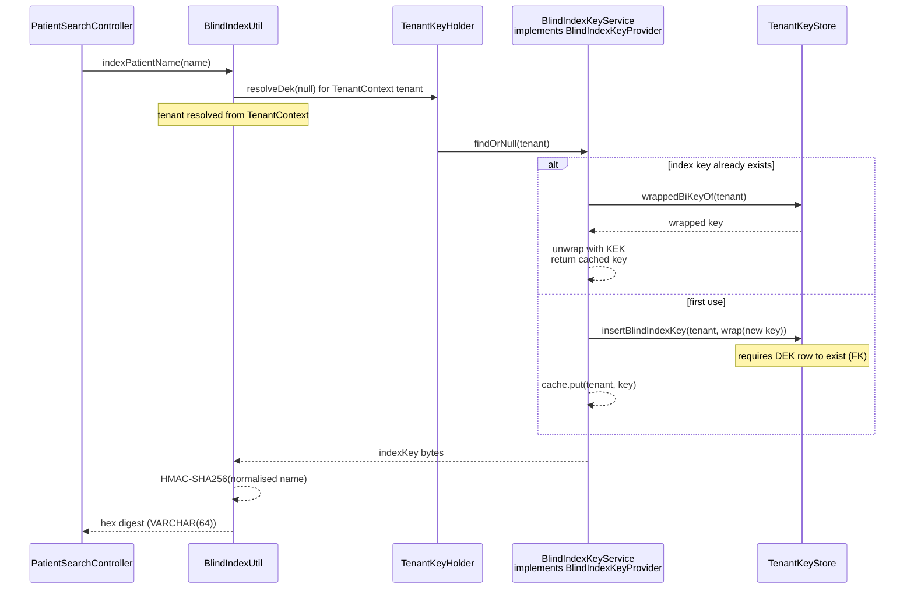
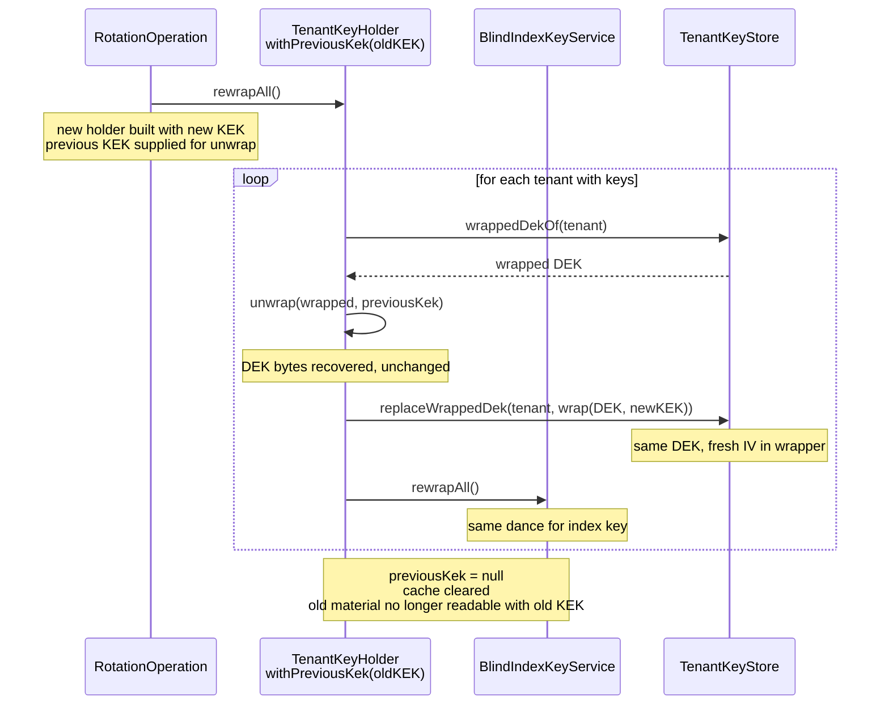
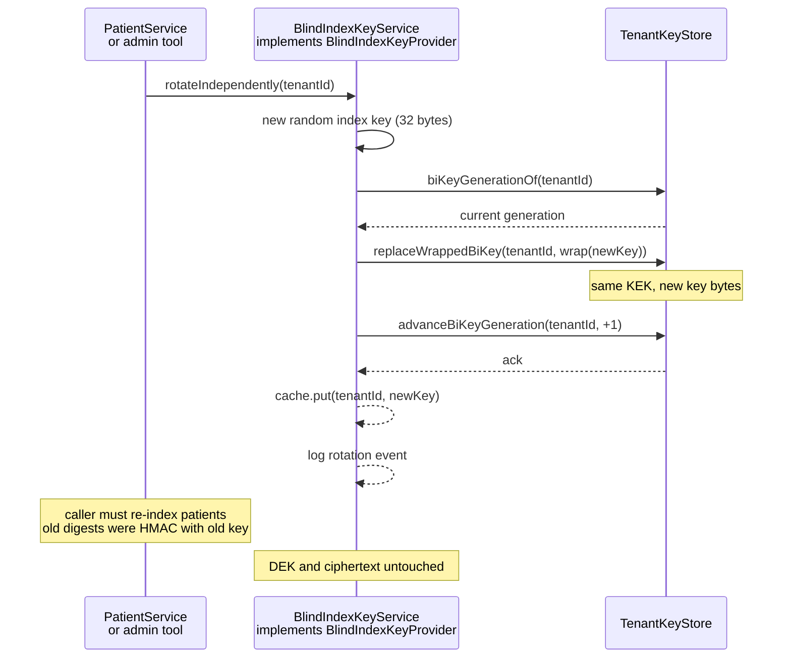

# Tenant Key Resolution Sequence

## Overview

The diagrams below describe the runtime flow of PII encryption and blind-index
computation through the deepened `tenant_key_resolution_seam`. Each diagram
covers a distinct responsibility extracted into its own module or interface.

## 1. PII field encryption (write path)

The JPA converter never resolves keys itself; it reaches the `TenantKeyResolver` via
the static `TenantKeyResolverFactory`, which Spring populates at startup.



## 2. Blind index computation (search path)

Search resolves a tenant's blind-index key through the same seam. The index key is
separate from the data key so a KEK re-wrap does not invalidate stored digests.



## 3. KEK rotation — online re-wrap

Re-wrapping changes only the wrapper around each key; the DEK and index key bytes are
unchanged, so no ciphertext or digest is rewritten. This is an online operation.



## 4. Blind index key independent rotation

A targeted rotation of the index key bumps its generation without touching the data key
or any ciphertext. Stored `name_index` digests stop matching by design.



## 5. Factory bridge for JPA converter

The static factory mediates between the JPA `AttributeConverter` (which Hibernate
instantiates) and the Spring-managed resolver, so DI is not required in the converter.

```mermaid
sequenceDiagram
    participant Spring as Spring Boot
    participant Config as EncryptionConfig
    participant Factory as TenantKeyResolverFactory
    participant Conv as EncryptionUtil<br/>AttributeConverter
    participant Format as PiiCiphertextFormat

    Spring->>Config: @PostConstruct / init()
    Config->>Factory: setInstance(TenantKeyHolder)
    Note over Config: holder populated with KEK + TenantKeyStore

    ... later, during entity flush ...

    participant Hibernate as Hibernate (flush)
    Hibernate->>Conv: convertToDatabaseColumn(value)
    Conv->>Format: format().encrypt(value)
    Format->>Factory: get()
    Factory-->>Format: TenantKeyResolver
    Format->>Format: dekResolver.resolveDek(generation)
    Format-->>Conv: ciphertext
    Conv-->>Hibernate: stored value

    ... in tests ...
    participant Test as Test
    Test->>Factory: reset() then setInstance(inMemoryResolver)
    Test->>Factory: get() returns test resolver
```
